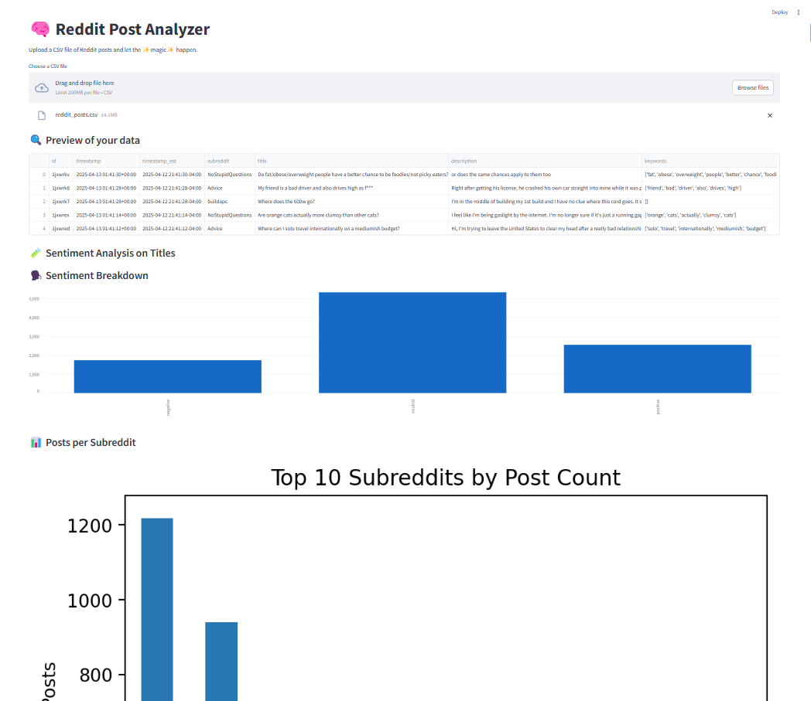

# Reddit Post Analyzer

This project analyzes Reddit posts across 100 subreddits using PySpark, sentiment classification, and data visualization. Our goal was to explore what makes posts go viral, how community sentiment differs across topics, and how businesses can leverage these insights.

---

## 🚀 Project Highlights

### 🖥️ Dashboard Preview



### 📊 [Final Presentation (PowerPoint)](./Reddit%20Big%20Data%20Final.pptx)

A summary of our project’s approach, key findings, and business applications.

---

## 📊 Project Overview

This project analyzes 9,600 Reddit posts collected over a 24-hour period (April 12–13, 2025) from 100 subreddits. Each post includes:

- Title and description
- Upvote counts at multiple time intervals
- Top comment (non-bot)
- Sentiment labels for both post and comment

We used:
- **Reddit API** for data collection  
- **PySpark** for data processing and SQL queries  
- **Gemini API** for sentiment classification  
- **Streamlit** to build an interactive dashboard  

---

## 📁 Repository Contents

| File | Description |
|------|-------------|
| `BigDataTeam10FinalProject.ipynb` | Main Jupyter notebook with PySpark SQL queries and analysis |
| `RedditPostAnalysis.ipynb` | Extra analysis and visualizations |
| `Reddit.py` | Script used to scrape and monitor Reddit post performance |
| `reddit_posts.csv` | Full cleaned dataset of Reddit posts |
| `Dashboard.png` | Dashboard screenshot |
| `Reddit Big Data Final.pptx` | Final project presentation |

---

## 🧠 Dataset Overview

- **Collection Timeframe**: April 12–13, 2025  
- **Volume**: 9,600+ posts from 100 subreddits  
- **Engagement Metrics**:  
  - `score_immediate`: Score at collection  
  - `score_3hr`: Score after 3 hours  
  - `score_8hr`: Score after 8 hours  
- **Comment Sentiment**: Sentiment of top (non-bot) comment  
- **Post Sentiment**: Sentiment from title and description  
- **Subreddit Category**: Posts grouped into 8 broad topics

---

## 💻 How to Load in PySpark

```python
from pyspark.sql import SparkSession

spark = SparkSession.builder.appName('Reddit Post Analysis').getOrCreate()

df = spark.read.option("header", True) \
    .option("inferSchema", True) \
    .option("multiLine", True) \
    .option("quote", '"') \
    .option("escape", '"') \
    .option("mode", "DROPMALFORMED") \
    .csv('reddit_posts.csv')

df_clean = df.filter("id IS NOT NULL AND subreddit IS NOT NULL AND title IS NOT NULL and id LIKE '1%'")
df_clean.createOrReplaceTempView("posts")
